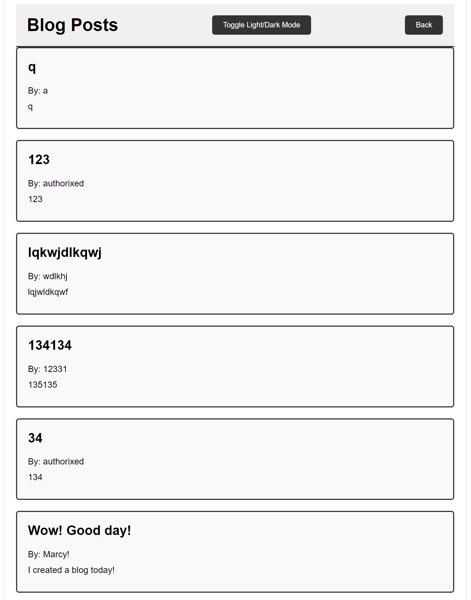

# Marcys-Blog
Welcome to my first multi-page website! This site welcomes you to "Marcy's Blog", and asks you whats on your mind. It gives you three different text entries, then submits to the localStorage and brings you to the blog posts!

# User Story
AS A marketing student  
I WANT a personal blog  
SO THAT I can showcase my thoughts and experiences

# Acceptance Criteria
GIVEN a personal blog  
WHEN I load the app,  
THEN I am presented with the landing page containing a form with labels and inputs for username, blog title, and blog content.  
WHEN I submit the form,  
THEN blog post data is stored to localStorage.  
WHEN the form submits,  
THEN I am redirected to the posts page.  
WHEN I enter try to submit a form without a username, title, or content,  
THEN I am presented with a message that prompts me to complete the form.  
WHEN I view the posts page,  
THEN I am presented with a header, with a light mode/dark mode toggle, and a "Back" button.  
WHEN I click the light mode/dark mode toggle,  
THEN the page content's styles update to reflect the selection.  
WHEN I click the "Back" button,  
THEN I am redirected back to the landing page where I can input more blog entries.  
WHEN I view the main content,  
THEN I am presented with a list of blog posts that are pulled from localStorage.  
WHEN I view localStorage,  
THEN I am presented with a JSON array of blog post objects, each including the post author's username, title of the post, and post's content.  
WHEN I take a closer look at a single blog entry in the list,  
THEN I can see the title, the content, and the author of the post.   
WHEN I view the footer, 
THEN I am presented with a link to the developer's portfolio.

# Website
[Visit the site!](https://authorixed.github.io/marcys-blog/)

# Resources

[Javascript W3 Schools](https://www.w3schools.com/js/)  
[CS W3 Schools](https://www.w3schools.com/css/default.asp)  
[HTML required attribite](https://www.w3schools.com/tags/att_input_required.asp)  
[DOMContentLoaded EventListener](https://developer.mozilla.org/en-US/docs/Web/API/Document/DOMContentLoaded_event)  
[How to create dark/light toggle](https://www.geeksforgeeks.org/how-to-create-dark-light-mode-for-website-using-javascript-jquery/#)
